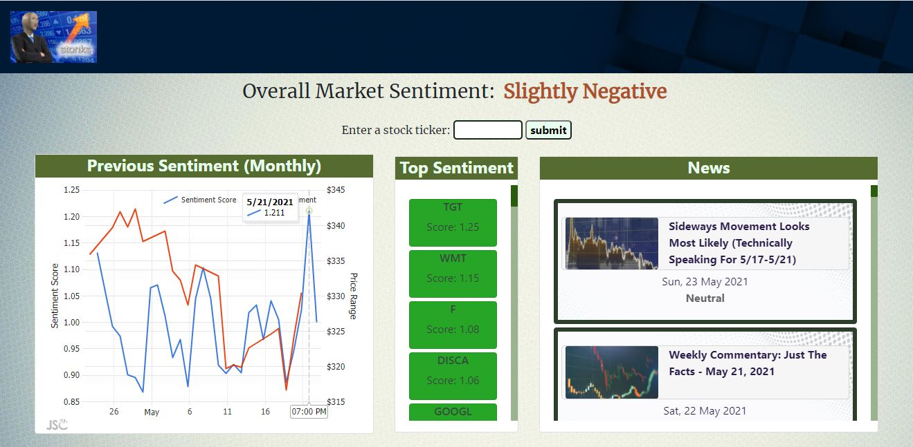
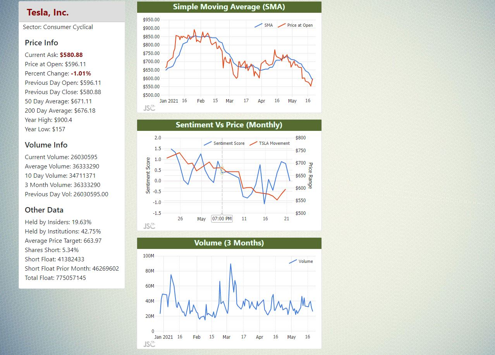

# Stock Dashboard

https://stock-news-dashboard.herokuapp.com/

## Table of Contents
* [Description](#description)
* [Future Additions](#future-additions)
* [Software Used](#software-used)
* [Images](#images)
* [Contact](#contact)
* [License](#license)

## Description
This is an application designed to provide a personal stock dashboard. The app takes data from several Stock APIs and presents a 
visual dashboard to provide trending stocks in the news and their current sentiment as well as provide several bits of technical
data and charts to make predictions on price movement. Note that as this is still a work in progress, there is no live website yet.

Deployed At: [https://floating-dusk-83595.herokuapp.com/](https://floating-dusk-83595.herokuapp.com/)

## Future Additions
* Provide data for recent senator stock transactions to compare to current trending tickers to determine if there are any correlations
* Create an algorithm to compare top mentioned tickers to several pieces of technical data, such as simple moving average divergence and
    current volume vs average volume to narrow down the list to the most likely movers, and to provide a method to visualize this data
* Create a database to save the predicted movers' price movement and technical data over a certain period of time to determine the accuracy 
    of the predictions
* Add a reddit wall street bets traffic engine to compare tickers to news mentions and other technical data

## Software Used
* HTML5
* CSS
* JavaScript ES6
* Node.js

## Images
 
 

## Contact
* Github: [KaleTEvans](github.com/KaleTEvans)
* Email: kaletevans@gmail.com

## License 
  This Software is licensed under the Apache License, Version 2.0. For further information and text regarding this license, visit [Apache License](http://www.apache.org/licenses/LICENSE-2.0)
